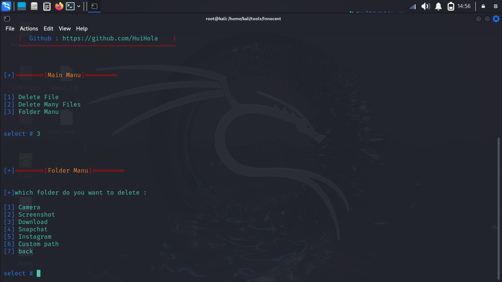

# Innocent
## About tool
**This tool can delete file and folders from victim android device by just downloading a app this a file manager penetration testing tool it have many good features it may undetectable until people missuse it**


## Features
* User friendly
* Alrady define basic path 
* Easy setup
##
**Disclaimer : This tool only for educational purposes**

##

## images


## setup package for kali linux
```bash
sudo apt install python3
sudo apt install openjdk-17
sudo apt install apktool
```
 ## setup package for ubuntu
```bash
sudo apt install python3
sudo apt install openjdk-17-jdk
sudo apt install apktool
```
 ## command
 **Run command on admin permission**
 ```bash
 git clone https://github.com/HuiHola/Innocent.git
 cd Innocent
 python3 innocent.py
 ``` 

## 
## Help section
**If you don't understand about this tool or any functionlty so it's can delete file and folders for victim android device if you know whare the file and what the file name then you can use first option 'Delete File' but if you want to delete many file you can use second option 'Delete Many Files' but you want to delete basic folder like camera and screenshots or delete another folder use 'Folder Manu' whare already define all basics
folder name just selete folder or use 'constom path' option to delete costom path.**
